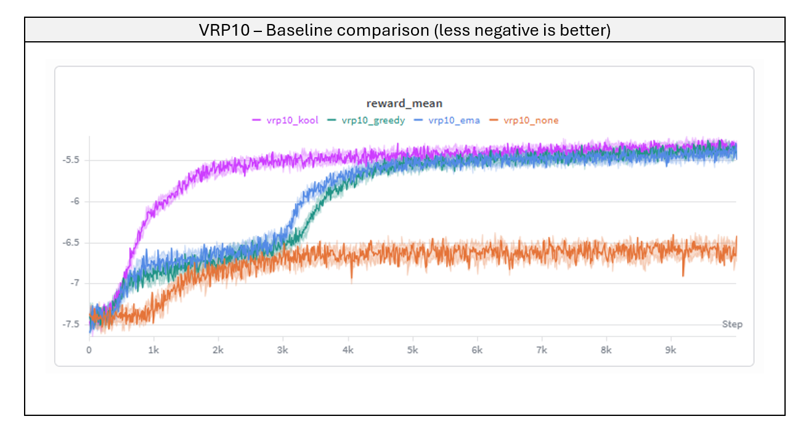
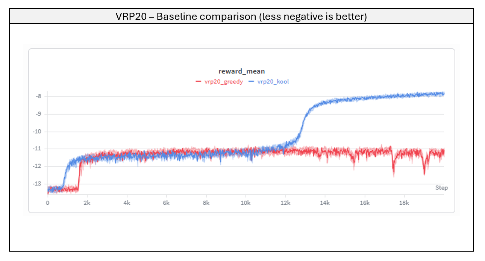
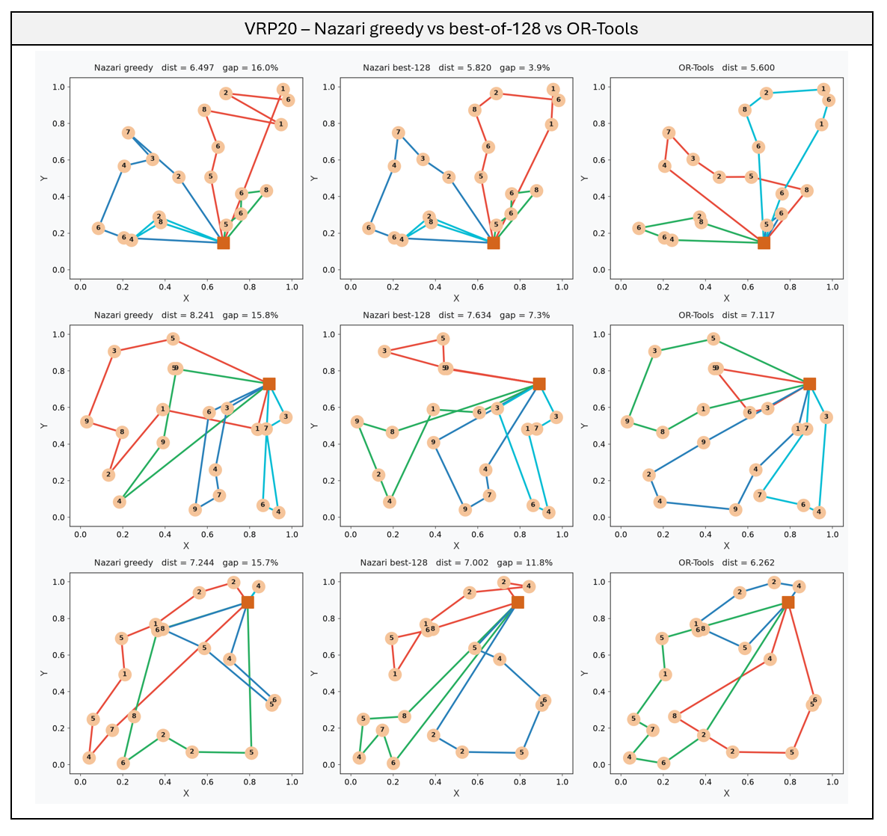
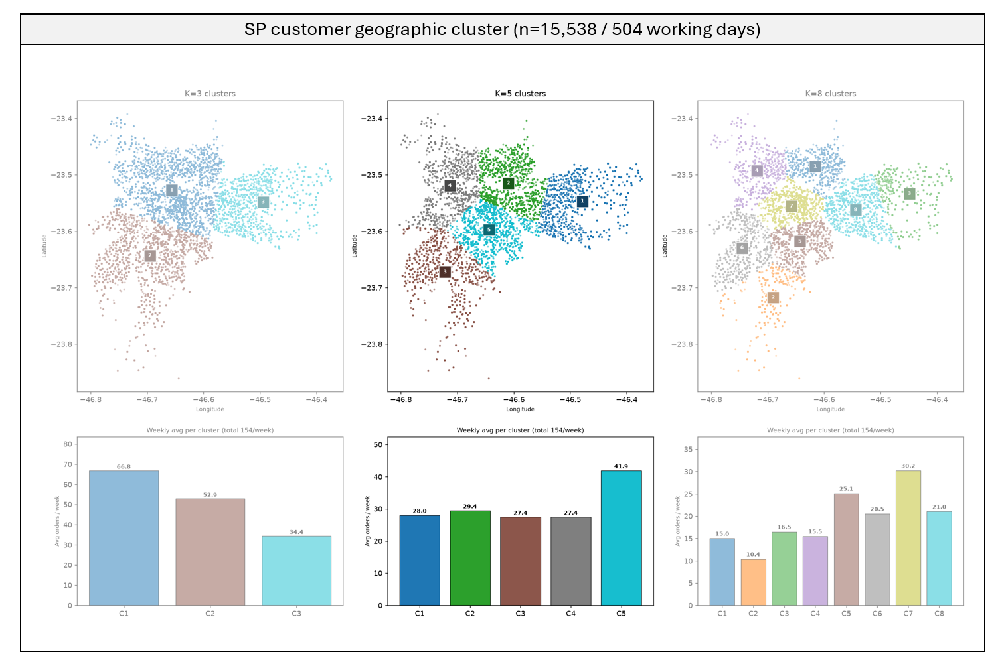
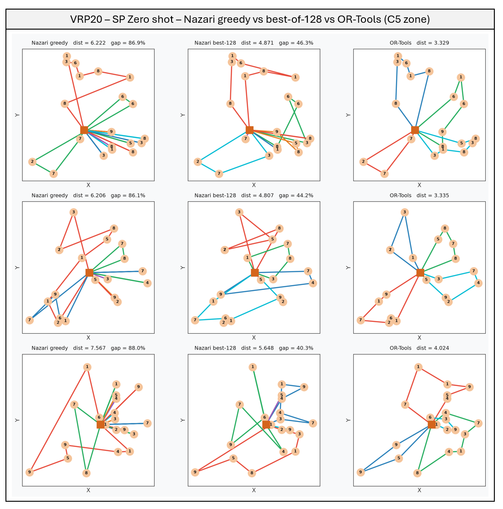

```{=html}
<div class="project-meta">
  <span><strong>Domain:</strong> Combinatorial Optimization</span>
  <span><strong>Industry:</strong> Logistics &amp; Supply Chain</span>
  <span><strong>Keywords:</strong> Vehicle Routing Problem, REINFORCE, Attention Model, Zero-Shot Transfer, Olist Brazil</span>
  <span><strong>Updated:</strong> Jul 2026</span>
</div>
```

*This page covers Part I of the project: reproducing Nazari et al. and putting it through a business-relevant stress test — speed vs. quality against a classical solver, then a zero-shot run on real São Paulo delivery data. [Part II](../nazari-vrp-sao-paulo/) trains the model directly on São Paulo's own geography and closes the gap this page exposes. Full technical detail — model code, training scripts, masking logic — is in the [GitHub repo](https://github.com/marceloarita/nazari-vrp-brazil).*

## TL;DR

- Reproducing Nazari et al. (2018)'s attention-based CVRP policy shows that the REINFORCE baseline is an architectural choice, not a tuning knob — a greedy baseline collapses at VRP20 while a frozen (Kool) baseline holds a 19.5% gap against OR-Tools, in exchange for a ~3,700x faster solve.
- That speed is what makes the gap easy to shrink for free: since one inference pass takes milliseconds, sampling 128 candidate routes and keeping the shortest still costs a fraction of a single OR-Tools solve — no retraining, and it nearly halves the gap.
- Tested zero-shot on real São Paulo delivery data, though, the gap jumps to 63.8% — a direct measurement of what training on synthetic, uniformly-distributed customers costs once the model meets a real city.

## Why routing gets hard fast

A vehicle routing problem is deceptively easy to state: given a depot and a list of customers with known demand, find efficient routes for a capacity-limited fleet that visits everyone exactly once. It's also combinatorially brutal — a 20-customer instance already has more than 10^17 possible route orderings, far beyond what an exact solver can search directly. Classical solvers handle this by pruning that space, trading time for optimality. Nazari's approach makes the opposite trade: it doesn't aim to find the optimal route, only a good enough one, almost instantly. The gain isn't solution quality — it's inference time, and that's the trade-off this project measures directly.

This project reproduces the attention-based policy from Nazari et al. (2018) end to end — architecture, REINFORCE training loop, and baseline variants — evaluates it at two problem sizes against OR-Tools as a classical baseline, and closes with a zero-shot test on real delivery data from São Paulo.

## The baseline choice is architectural, not a hyperparameter

REINFORCE — the algorithm used to train the policy — needs a reference value, called a baseline, to judge whether a given route turned out better or worse than expected. Four ways of computing that reference were tested on VRP10 under identical conditions: no baseline, an exponential moving average of past rewards, a greedy baseline (the model's own current tour), and a Kool baseline (a frozen copy of the model, updated only when a statistical test confirms real improvement).



| Baseline | Gap% vs OR-Tools |
|---|---|
| No baseline | 84.7% |
| EMA | 14.8% |
| Greedy | 13.1% |
| Kool | 17.1% |

*Gap% based on 32 validation instances.*

At VRP10, the problem is small enough that greedy and Kool land at essentially the same quality — the gap between them is within sampling noise (based on 32 validation instances). Only "no baseline" is a clear outlier. That result would suggest baseline choice barely matters, except it doesn't hold at the next size up.



| Baseline | Gap% vs OR-Tools |
|---|---|
| Greedy | 179.4% |
| Kool | 19.5% |

*Gap% based on 32 validation instances.*

At VRP20, greedy collapses into a degenerate policy. Because the policy and its own baseline share the same weights, the moment the policy improves, the baseline improves right along with it, and the learning signal disappears before it converges. Kool's frozen copy breaks that feedback loop instead. Greedy and Kool aren't two points on the same curve; one of them simply doesn't converge once the problem is big enough to matter — the mechanics of why are in the repo.

## Decoding for free: sampling closes most of the gap

Training isn't the only lever. At inference time, instead of taking the model's single best guess for each customer (*greedy* decoding), you can sample 128 candidate routes from the same trained policy and keep the shortest one — no retraining required.

| Problem | Baseline | Greedy gap | Best-of-128 gap |
|---|---|---|---|
| VRP10 | Kool | 17.1% | 4.3% |
| VRP20 | Kool | 19.5% | 8.9% |

Sampling roughly quarters the VRP10 gap and cuts the VRP20 gap in half — for the cost of running the same fast model 128 times instead of once, still nowhere near OR-Tools' 30-second search. The visual effect is just as clear:



*A single vehicle makes multiple trips from the depot, reloading between each; every color is one trip. Greedy routes (left) often cross themselves — a single trip forming an X, backtracking across ground it already covered, because the model commits to each next customer without simulating how that choice plays out later. Best-of-128 (middle) removes most of these crossings just by sampling more candidates; OR-Tools (right) still routes the cleanest, along each cluster's perimeter.*

## Speed vs. quality: the actual trade-off

None of this matters without weighing it against what you get in return. OR-Tools searches for up to 30 seconds per instance; Nazari runs a full batch in a single forward pass.

| Problem | Nazari (greedy) | OR-Tools (GLS) | Speedup |
|---|---|---|---|
| VRP10 | ~2 ms/instance | ~5 s/instance | ~2,500x |
| VRP20 | ~8 ms/instance | ~30 s/instance | ~3,700x |

For dispatch systems making hundreds of routing calls in real time — or simulating thousands of scenarios where near-optimal is good enough — that speedup alone is the trade worth making. It's also exactly what makes best-of-128 sampling cheap in the first place: running the model 128 times and keeping the shortest tour still costs a fraction of a single OR-Tools solve, which is why that lever is free in practice, not just in theory.

## Zero-shot on São Paulo

Every result above comes from customers scattered uniformly inside a unit square — a convenient synthetic distribution, and nothing like a real city. To measure that gap directly, VRP20 instances were built from the Olist Brazilian e-commerce dataset: ~15,200 São Paulo orders, geocoded via postal-code prefix, split into 5 natural delivery zones by K-means, with order weight mapped into the same demand range the model was trained on.



Running the VRP20 Kool model zero-shot — no retraining — against 32 held-out real-customer instances sampled from each zone:

| Cluster | Model | OR-Tools | Greedy gap | Best-of-128 gap |
|---|---|---|---|---|
| C1 (Leste) | 5.473 | 3.557 | 54.4% | 21.2% |
| C2 (Norte) | 5.435 | 4.136 | 31.5% | 15.8% |
| C3 (Sul) | 6.255 | 3.358 | 90.1% | 34.0% |
| C4 (Oeste) | 5.054 | 3.260 | 57.0% | 27.2% |
| C5 (Centro-Sul) | 6.356 | 3.429 | 86.0% | 36.6% |
| **Overall** | **5.715** | **3.548** | **63.8%** | **26.9%** |

The gap jumps from 19.5% on synthetic uniform instances to 63.8% on real customers (greedy). Best-of-128 sampling — the same free lever that helped on synthetic data — roughly halves it, to 26.9%, but can't close it: sampling only explores tours from a policy that never saw clustered geography, so the distribution mismatch sets a ceiling that decoding tricks can't lift.



*Greedy routes sprawl with long crossings; best-of-128 tightens them, but the policy never learned São Paulo's dense structure, so both stay far from OR-Tools.*

## What this shows

The interesting parts of this project are two things a straight reimplementation wouldn't surface on its own:

- The REINFORCE baseline is an architectural decision, not a tuning knob — invisible at VRP10, decisive at VRP20.
- A controllable ~9–20% gap on the training distribution and a 63.8% gap on real customers are both true of the same model — the difference is a precise measurement of what "trained on synthetic, uniform data" costs once it meets a real city.

Closing that gap — training directly on São Paulo's own spatial distribution — is the subject of **[Part II](../nazari-vrp-sao-paulo/)**, which takes the hardest zone from a 36.6% gap down to 3.8%.

---

*Code on [GitHub](https://github.com/marceloarita/nazari-vrp-brazil).*
