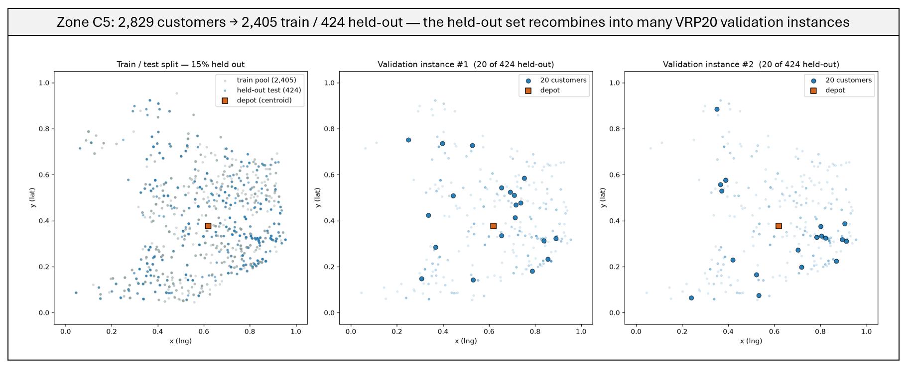
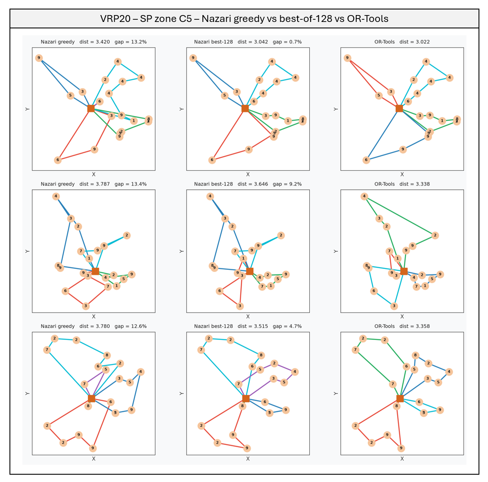
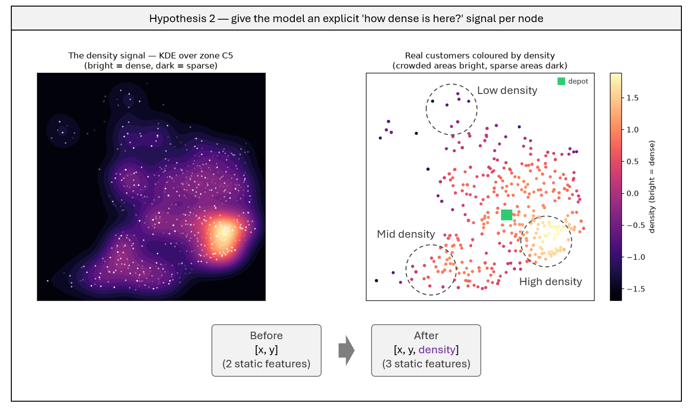
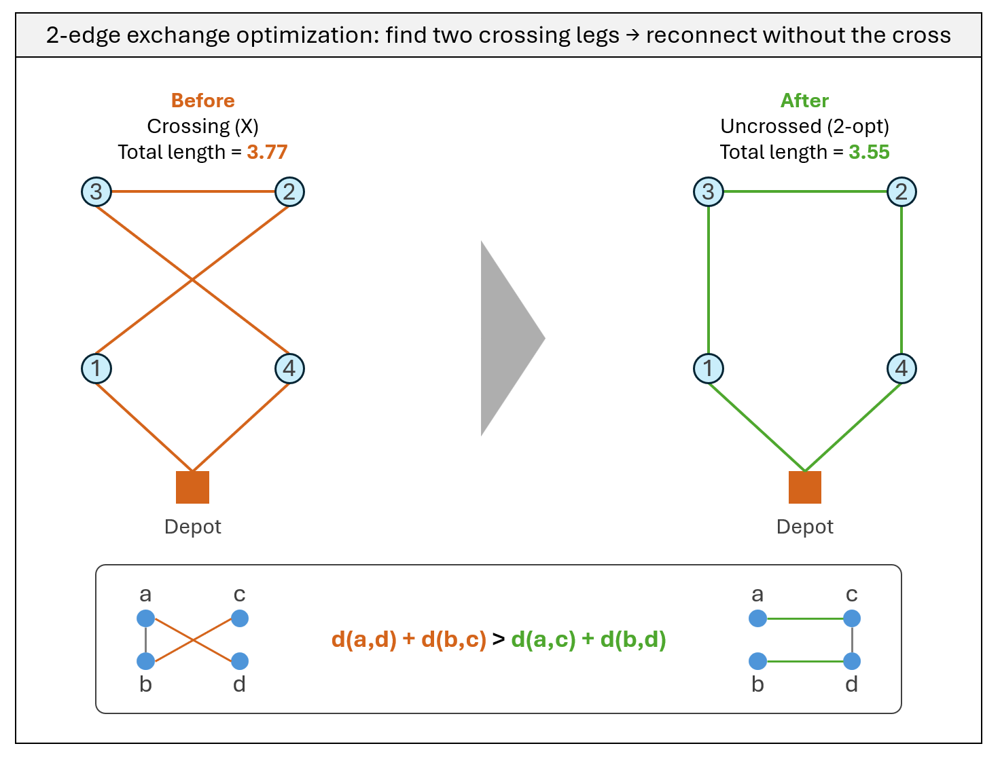
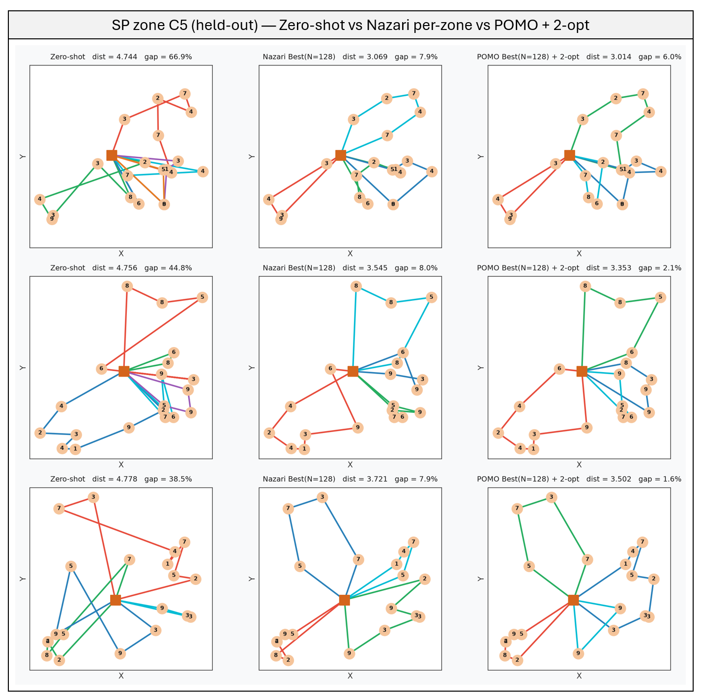

```{=html}
<div class="project-meta">
  <span><strong>Domain:</strong> Combinatorial Optimization</span>
  <span><strong>Industry:</strong> Logistics &amp; Supply Chain</span>
  <span><strong>Keywords:</strong> Vehicle Routing Problem, Reinforcement Learning, Zero-Shot Transfer</span>
  <span><strong>Updated:</strong> Jul 2026</span>
</div>
```

*This is Part II, continuing directly from [Part I](../nazari-vrp-brazil/), which reproduced Nazari et al. (2018) and applied it zero-shot to real São Paulo delivery data — exposing a 63.8% gap (26.9% with best-of-128 sampling) against OR-Tools. This page covers how that gap was closed. Full technical detail — code, training scripts, hypothesis logs — is in the [GitHub repo](https://github.com/marceloarita/nazari-vrp-brazil).*

{width=50%}

```{=html}
<div class="stat-callout">
  <strong>Do you know?</strong> Last-mile delivery accounts for 53% of total delivery costs in logistics (<a href="https://www.clickpost.ai/blog/last-mile-delivery-statistics">source</a>).
</div>
```

## TL;DR

- Training the exact same model on a single São Paulo zone's own customers — instead of generic synthetic data — cuts the zero-shot gap from 86.0% to 14.0% (greedy), with zero changes to the model architecture.
- Not every idea helped: adding an explicit "how crowded is this area" feature backfired, more than tripling the gap — a reminder that more input isn't automatically better.
- Swapping the training signal for POMO — which grades routes against each other instead of a frozen reference — squeezes out another point or two, for free.
- A deterministic, zero-cost geometric cleanup (2-opt) shaves off further points, landing the final model at **3.8%** from OR-Tools — down from 36.6% at the end of Part I.

## The question Part I left open

Part I's diagnosis was clean: a routing model trained on generic, uniformly-scattered customers falls apart on a real city — not because the model is too small, but because it never saw what a real city looks like. That's a useful thing to know, but it's not a fix. Part II asks the direct follow-up: **if the model actually learns São Paulo's own geography, does the gap close?**

To keep the effort focused and every claim measurable, the work concentrates on one zone — **C5 / Centro-Sul**, the densest and hardest zone from Part I (36.6% gap under best-of-128). The logic: if an approach works on the hardest, most irregular zone, it should carry over to the easier ones. Every number below is measured on a **held-out set** — 15% of the zone's real customers, never seen during training — so a good score can't be explained by memorization.



## Training on the target city closes most of the gap

The most direct fix for a model that never saw clustered geography is to train it on that geography directly. Three things make this concrete: each zone is normalized to its own bounding box (matching exactly how it's evaluated), the train/test split is leakage-free, and training instances are sampled straight from real customers — no synthetic data needed.

| Model | Greedy gap | Best-of-128 gap |
|---|---|---|
| Zero-shot uniform (Part I baseline) | 86.0% | 36.6% |
| **Trained on zone C5** | **14.0%** | **6.6%** |



Same architecture, same hyperparameters — just the right training data — and the gap collapses from 86% to 14% (greedy), 37% to 7% (best-of-128). This confirms Part I's diagnosis directly: the barrier was never model capacity, it was what the model was asked to learn. This per-zone model becomes the new baseline the rest of this page tries to beat.

## When more information backfires

An intuitive next step: if the model has to infer how crowded a neighborhood is, why not just tell it? A density value — computed once per customer from a kernel density estimate — was added as a third input feature alongside each customer's coordinates.



| Model | Greedy gap | Best-of-128 gap |
|---|---|---|
| Without density feature | 14.0% | 6.6% |
| **With density feature** | **52.3%** | **14.6%** |

The feature made things worse, by a wide margin. The likely reason: the model can already infer local density from the 20 coordinates it sees, so the explicit feature added little signal — and the density values, on a much wider numeric scale than the `[0,1]` coordinates, likely overwhelmed the input. Worth noting as much as any win: a plausible-sounding feature idea was tested, measured, and dropped rather than kept on faith.

## A smarter training signal, for free

The Kool baseline used in Part I works by freezing a copy of the model as a reference point. **POMO** (Kwon et al., 2020) takes a different approach: instead of a frozen copy, it exploits the fact that a route is a loop — starting from customer A, B, or C describes the same trip — and runs several versions of the same instance, each forced to start from a different customer. Those versions grade each other, the way a class average grades each individual student, with no frozen reference needed. It's known to generalize better to unseen data, which is exactly the concern here.

Same model, same per-zone data as before — only the training signal changes.

| Model | Greedy gap | Best-of-128 gap |
|---|---|---|
| Per-zone (Kool baseline) | 14.0% | 6.6% |
| **Per-zone (POMO)** | **11.9%** | **5.5%** |

A modest but consistent gain across both decoding strategies — small, but real, and it comes at no extra inference cost.

## A cheap geometric polish: 2-opt

Not a training change at all — just a cleanup rule applied to whatever route the model already produced. Whenever two legs of a route cross, forming an X, reconnecting them the other way is *always* shorter, by simple geometry (the triangle inequality). Repeat until no crossing is worth undoing.



| Model | Best-of-128 | Best-of-128 + 2-opt |
|---|---|---|
| Per-zone (Kool baseline) | 6.6% | 4.7% |
| **Per-zone (POMO)** | **5.5%** | **3.8%** |

It costs nothing — no training, no retraining, just a handful of geometric checks — and it shaves off roughly two more points from every variant, on top of gains that already came from training data and the learning signal.

## The whole story, one table

Every row below is measured on the same 32 held-out instances of zone C5:

| Step | Lever | Greedy gap | Best-of-128 gap |
|---|---|---|---|
| Zero-shot uniform (Part I baseline) | — | 86.0% | 36.6% |
| Train on the target zone | Data | 14.0% | 6.6% |
| Switch to POMO | Learning signal | 11.9% | 5.5% |
| Add 2-opt cleanup | Decoding | — | **3.8%** |



From 36.6% to 3.8%, without changing the model's architecture at all. The wins came from three different places — the training data, the training signal, and a free geometric cleanup — stacked on top of each other.

## What this shows

- **Zero-shot doesn't transfer, but the fix isn't a bigger model — it's the right training data.** Training on the target zone's own customers, with no architecture change, does most of the work: 86% to 14%.
- **A smarter training signal and a cheap cleanup both add real, if smaller, gains — for free.** POMO and 2-opt together take the per-zone model from 6.6% to 3.8%, at no extra training or inference cost worth mentioning.
- **Not every reasonable-sounding idea pays off.** The density feature was a sound hypothesis, tested rigorously, and rejected because it made things worse — worth stating plainly rather than quietly dropping.

This was deliberately scoped to one zone, one problem size, and Euclidean distances — a controlled test of *whether* the fix works, not a production benchmark. Extending it to the other four zones, variable fleets, and real road distances is the natural next step; the technical write-up in the [GitHub repo](https://github.com/marceloarita/nazari-vrp-brazil) covers the full scope and limitations.

---

*Code on [GitHub](https://github.com/marceloarita/nazari-vrp-brazil).*
