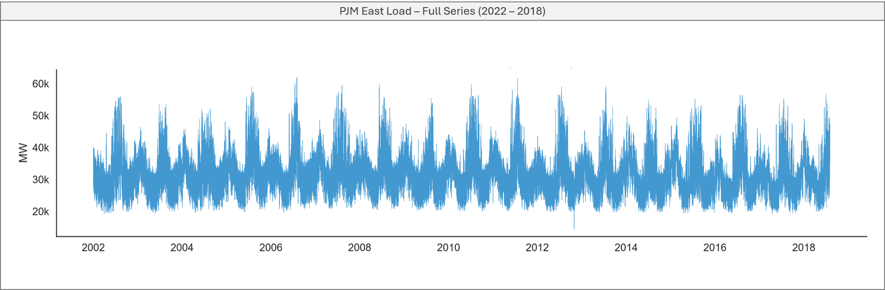
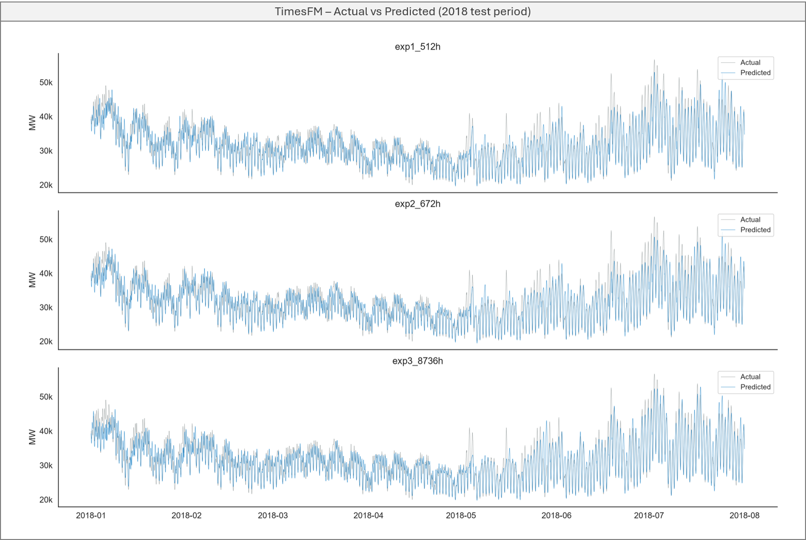
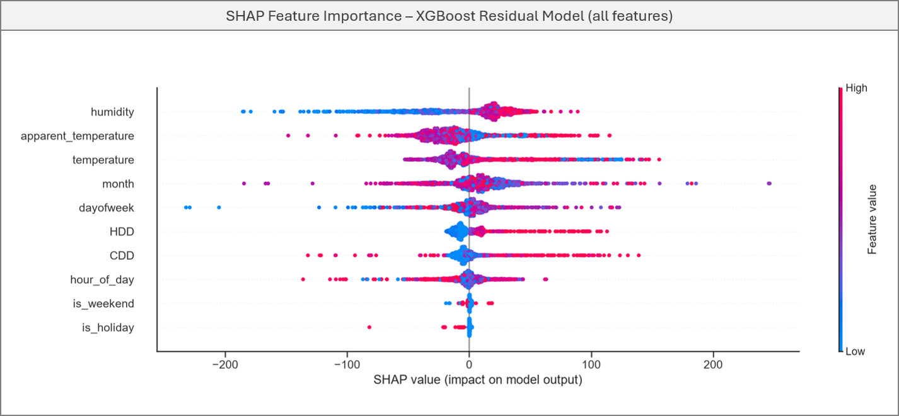
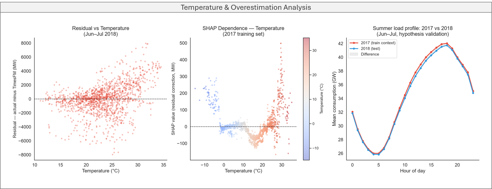

```{=html}
<div class="project-meta">
  <span><strong>Domain:</strong> Time Series</span>
  <span><strong>Industry:</strong> Energy &amp; Utilities</span>
  <span><strong>Keywords:</strong> Time Series, TimesFM, Zero-Shot Forecasting, XGBoost, SHAP</span>
  <span><strong>Updated:</strong> Jun 2026</span>
</div>
```

## Why this problem is harder than it looks

Predicting electricity demand hour by hour sounds straightforward — the data is regular, the patterns are visible, and grids have been doing this for decades. But the difficulty is in the details. A single heat wave can push demand up by thousands of megawatts in hours. A holiday shifts the entire daily profile. An extreme weather event like a hurricane can collapse consumption overnight.

The standard solution is a dedicated model trained on historical data from the specific grid you care about. It works well — but it requires data, time, and ongoing maintenance for every new series you add.

I wanted to test a different approach: skip the training entirely, hand a pre-trained foundation model some recent history, and see if it could produce useful forecasts out of the box.

## TimesFM and the zero-shot premise

TimesFM 2.5 (Time Series Foundational Model) is a foundation model from Google Research, pre-trained on hundreds of billions of time series points across diverse domains — energy, retail, finance, weather. The premise is the same as modern LLMs: train on enough diverse data and the model learns patterns that generalize to new domains without retraining.

In practice, this means you give it a window of recent history as context, and it returns a forecast. No fine-tuning. No domain-specific features. No knowledge of what a power grid is.

The honest prior going in: a model with no energy-specific training should capture general temporal patterns reasonably well — daily and weekly cycles are not unique to power grids. Whether it could beat even a naive baseline was less obvious.

## 16 years of a power grid

The dataset is hourly load data from the PJM East grid — the electrical network serving the northeastern United States, from 2002 to 2018. Strong daily cycles, clear weekly rhythms, pronounced annual seasonality driven by heating and cooling demand.



One data quality issue worth addressing before modeling: Hurricane Sandy in October 2012 caused a sharp sustained drop in consumption across the region. Rather than letting that anomaly distort the model's context window, those hours were replaced with historical averages for the same hour and day of week from the three prior years — preserving continuity without ignoring the event.

## How much context does the model need?

TimesFM processes input as fixed-size patches of 32 points. This has a direct implication for input design: context length should align with the series' natural cycles to avoid cutting them mid-patch. For hourly energy data with daily (24h) and weekly (168h) cycles, the mathematically clean choice is LCM(32, 24, 168) = 672 hours — four weeks of fully aligned history.

Three context lengths were evaluated against a naive baseline — repeat the same hour from the previous day — using walk-forward validation over the first 7 months of 2018:

| Context | MAPE | Scaled MAE |
|---------|------|------------|
| Naive lag-24h | 7.91% | 1.000 |
| 512h (~3 weeks) | 4.74% | 0.630 |
| 672h (~4 weeks, cycle-aligned) | 4.63% | 0.616 |
| 8,736h (1 year) | **4.44%** | **0.580** |

Scaled MAE below 1.0 means the model beats the naive baseline. All three configurations did.

The bigger insight is in the pattern across context lengths. Cycle alignment helps modestly. The real gain comes from a full year of history — with 8,736 hours of context, the model can see that January 2018 should look like January 2017. That's a pattern no three-week window can capture.



## Where the model fails: weather

A 4.44% MAPE is a solid result for a zero-shot model. The more interesting question is where the remaining error comes from. Training an XGBoost model on TimesFM's residuals — using weather and calendar features — and analyzing it with SHAP gives a clear answer.



The three most important features are all weather-derived: humidity, apparent temperature, and temperature. Calendar features barely register. TimesFM already handles temporal structure well — it has internalized weekdays, weekends, and seasonal patterns from pre-training. What it cannot account for is current weather conditions.

On days above 25°C, the mean residual is +1,331 MW — the model consistently underestimates actual consumption. Air conditioning on hot days pushes demand beyond what historical temporal patterns suggest, and there's no mechanism in a pure time series model to capture that.



The residual vs temperature scatter makes this visible: as temperatures rise above ~22°C, errors shift systematically upward. XGBoost learned to correct for this — but the correction was modest. Adding it reduced the hot-day residual from +1,331 MW to +1,235 MW and improved Scaled MAE from 0.580 to 0.562. The bottleneck was data volume: roughly 520 hours above 25°C in the training window, too few to learn the correction reliably.

## What this tells us about foundation models

TimesFM outperformed the naive baseline across all configurations — on a domain it was never explicitly trained for, with no fine-tuning and no energy-specific features. That result holds up.

The more useful finding is about failure modes. The model doesn't fail randomly — it fails systematically, in predictable regimes. That predictability matters more than it might seem: it means errors can be diagnosed and corrected with targeted interventions rather than retraining the entire model. The ensemble added value not because XGBoost predicted residuals well (R² = 0.034) but because it corrected a consistent directional bias in a specific climate regime.

Zero-shot time series models are not a replacement for domain expertise. But as a starting point — especially when historical data is limited or you're forecasting across many series — they're further along than expected.

One caveat worth noting: the PJM East dataset is publicly available and widely used in the time series literature, so there is a possibility that part of this data was included in TimesFM 2.5's pre-training corpus. For a rigorous scientific benchmark, that would be a relevant limitation. The goal here is educational — to explore model behavior, validate intuitions about input engineering, and understand where the ensemble approach adds value and where it doesn't. Results should be interpreted in that context.

---

*Code and full analysis on [GitHub](https://github.com/marceloarita/timesfm-introduction/tree/main/01-energy-forecasting).*
