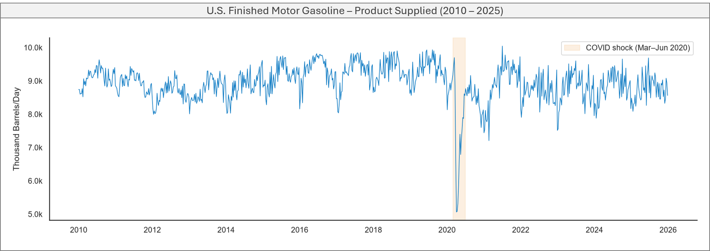
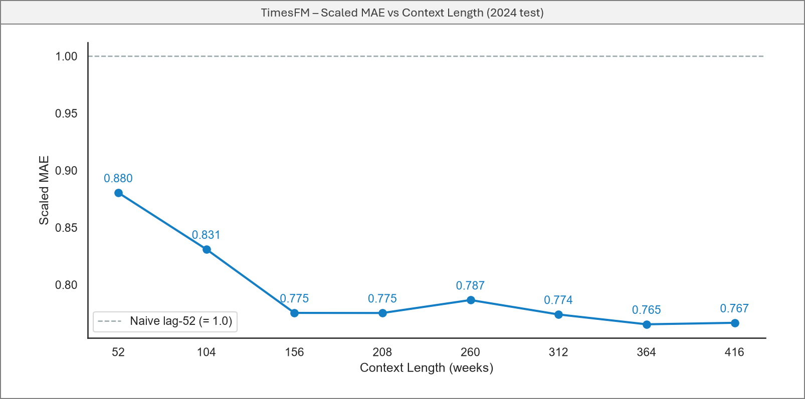
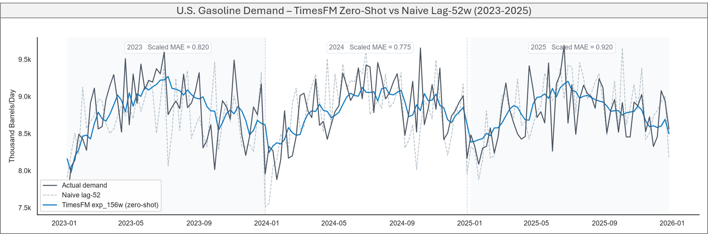
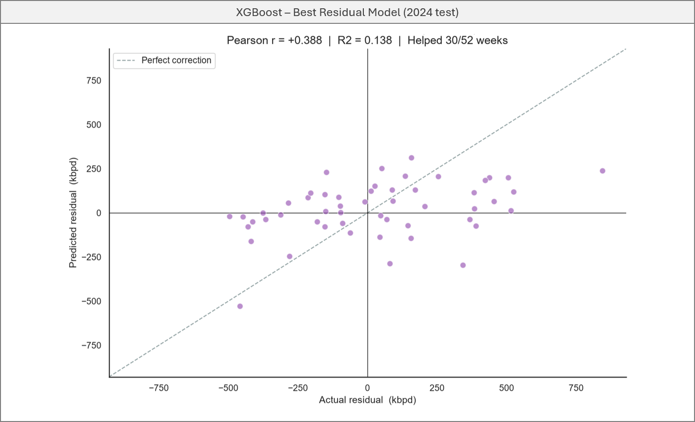

```{=html}
<div class="project-meta">
  <span><strong>Domain:</strong> Time Series</span>
  <span><strong>Industry:</strong> Oil &amp; Gas</span>
  <span><strong>Keywords:</strong> Time Series, TimesFM, Zero-Shot Forecasting, XGBoost</span>
  <span><strong>Updated:</strong> Jun 2026</span>
</div>
```

## Why gasoline is a different kind of problem

Energy demand has a reliable structure: daily peaks, weekly rhythms, seasonal swings. Gasoline demand doesn't. There's no meaningful hour-by-hour cycle — the data is weekly — and the annual seasonality, while real, is subtle enough to be obscured by week-to-week noise. On top of that, consumption is heavily influenced by factors a time series model simply cannot see: fuel prices, macroeconomic conditions, driving behavior, and — as 2020 demonstrated — global pandemics.

This makes gasoline a harder test for a zero-shot foundation model than energy demand. The question is the same: can TimesFM 2.5 outperform a naive baseline without any domain-specific training? But the bar is lower, the signal is weaker, and the failure modes are more likely to be structural.

## The dataset

The data is U.S. Finished Motor Gasoline Product Supplied, published weekly by the EIA — 835 weeks from January 2010 through December 2025. Product supplied is a proxy for actual consumption: it measures how much gasoline leaves the distribution system each week.



The series shows a long-term plateau around 8,500–9,000 thousand barrels per day, a sharp drop during COVID-19 in 2020, and a modest recovery after. Annual seasonality exists — summer peaks are visible — but week-to-week variation is high enough to make the pattern hard to exploit without the right context window.

## Finding the right context without a natural cycle

In the energy project, context length was derived mathematically: align to the LCM of the patch size and the series' natural cycles. Gasoline demand has no clean patch-aligned cycle to work from, so a different approach was needed — sweep across context lengths empirically and look for the elbow where gains stabilize.



The elbow is at 156 weeks — roughly 3 years. Scaled MAE drops sharply from 52w to 156w, then flattens. Going beyond 3 years adds memory overhead without meaningful improvement, and risks pulling in older regimes — pre-shale boom, pre-COVID — that no longer reflect current consumption patterns.

## Does it beat the naive baseline?

The naive baseline for a weekly series is lag-52: repeat the same week from the previous year. It's a strong baseline for seasonal data — and gasoline has enough annual seasonality to make it hard to beat consistently.

TimesFM was evaluated on three consecutive years of out-of-sample data, with no retraining between years:

| Year | Model | MAPE | Scaled MAE |
|------|-------|------|------------|
| 2023 | Naive lag-52 | 4.06% | 1.000 |
| 2023 | TimesFM 156w | 3.34% | **0.820** |
| 2024 | Naive lag-52 | 3.73% | 1.000 |
| 2024 | TimesFM 156w | 2.88% | **0.775** |
| 2025 | Naive lag-52 | 3.02% | 1.000 |
| 2025 | TimesFM 156w | 2.79% | **0.920** |

Three consecutive years, all below 1.0. For a zero-shot model on a series dominated by external factors, that's a stronger result than expected.



## Can a residual model add value?

After establishing the TimesFM baseline, the natural next question is whether a residual correction model can reduce the remaining error. Four candidates were evaluated on the 2014–2023 walk-forward residuals:

| Model | R² (residual) |
|-------|---------------|
| XGBoost | **0.138** |
| LightGBM | 0.081 |
| ElasticNet CV | −0.024 |
| Lasso CV | −0.027 |

XGBoost explains only 14% of the residual variance. Linear models fail entirely — negative R² — suggesting the relationship between available features and TimesFM's errors is non-linear and sparse. The ensemble still improved results:

| Model | MAPE | Scaled MAE |
|-------|------|------------|
| Naive lag-52 | 3.73% | 1.000 |
| TimesFM 156w | 2.88% | 0.775 |
| TFM + XGBoost residual | 2.73% | **0.735** |

The improvement is real but modest — a direct consequence of the low R² on residuals. The scatter below makes this visible: XGBoost predictions correlate weakly with actual residuals, and many weeks the correction moves in the wrong direction entirely.



Unlike the energy project, where the residual had a clear weather-driven structure that XGBoost could exploit, here the noise is more fundamental. The errors are driven by behavior and macro factors that calendar and lag features cannot capture.

## What this tells us

TimesFM beat a strong naive baseline across three consecutive years on a noisy, externally-driven series — without retraining, without domain features, and without any knowledge of gasoline markets.

The harder finding is on the ensemble side. In the energy project, XGBoost corrected a systematic climatic bias and added measurable value. Here, TimesFM's errors are largely unpredictable from available features. That's not a failure of the model — it's a property of the problem. Gasoline demand is harder to correct because the signal driving the errors isn't in the data you have access to.

That distinction matters when deciding how to deploy foundation models in practice. For series with identifiable, correctable error structure — use the ensemble. For series where errors are macro-driven and opaque — the zero-shot model alone is likely your best option.

---

*Code and full analysis on [GitHub](https://github.com/marceloarita/timesfm-introduction/tree/main/02-gasoline-forecasting).*
